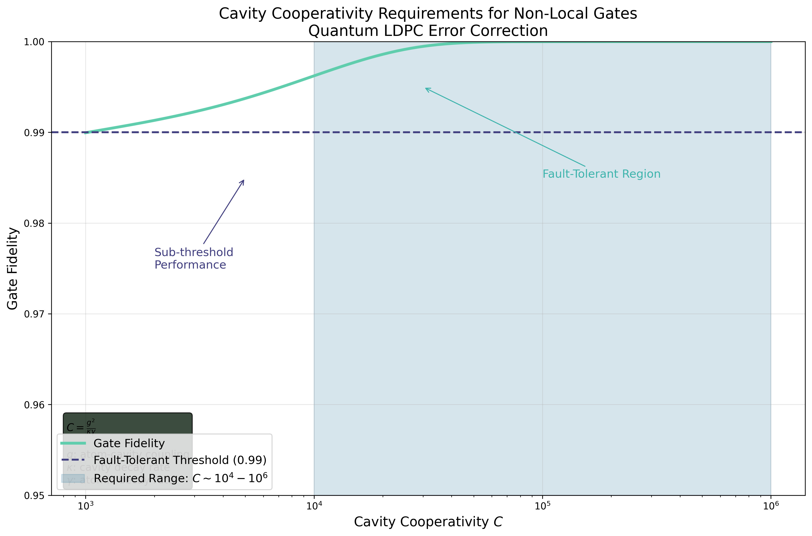
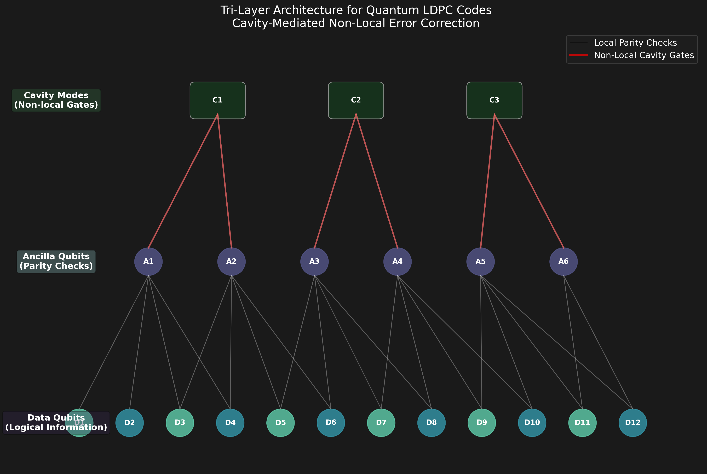
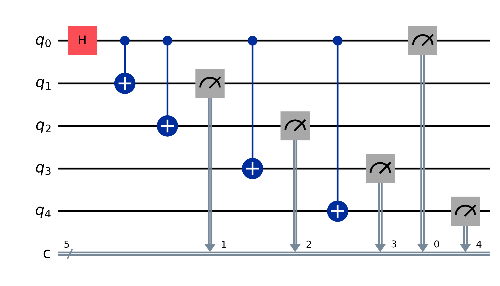
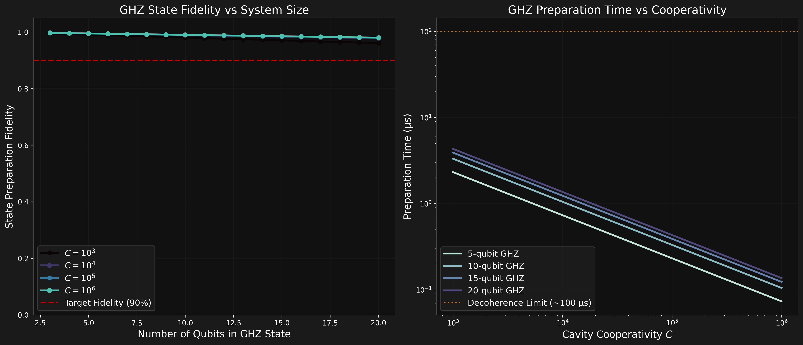
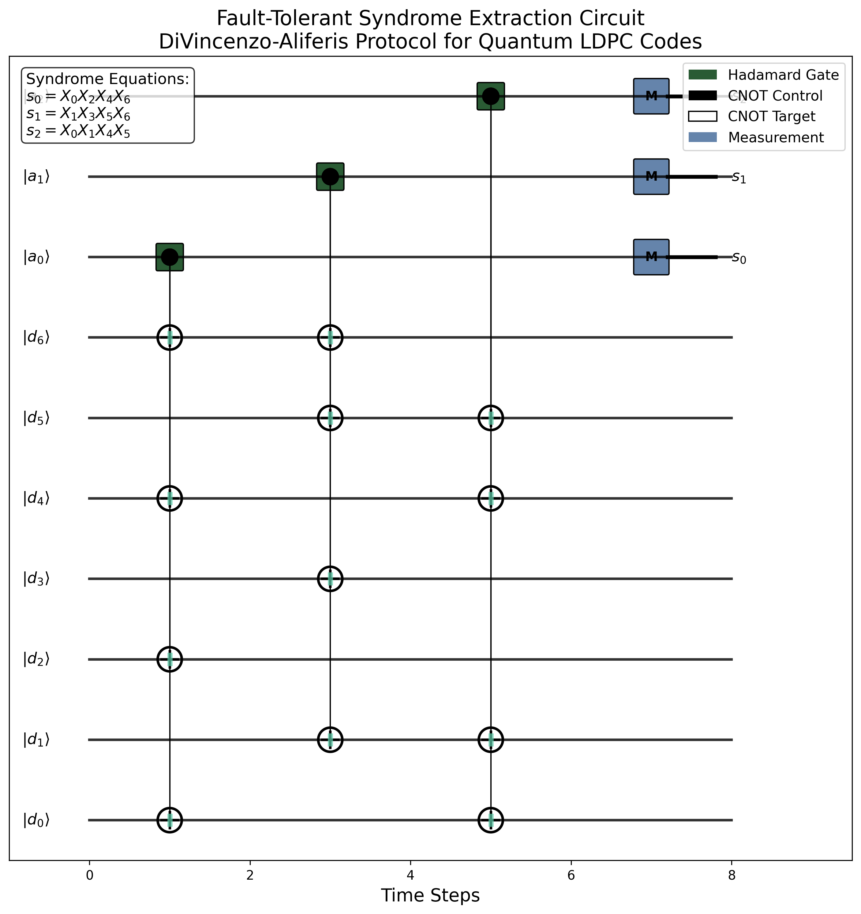
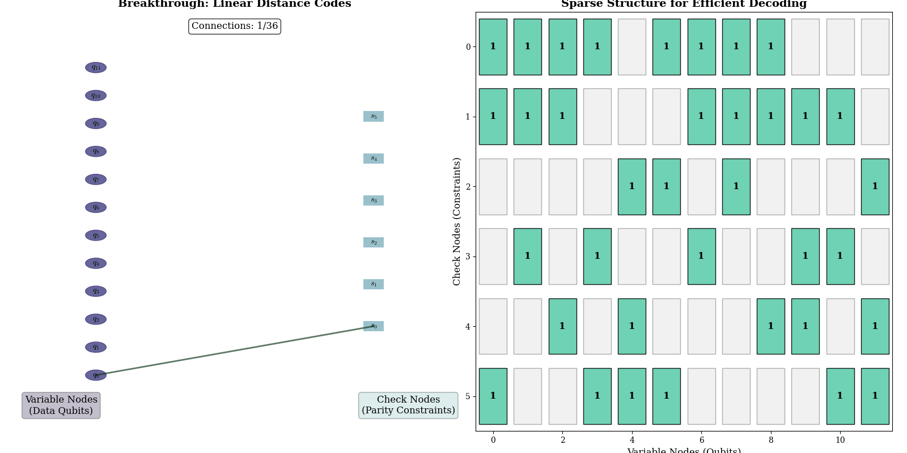
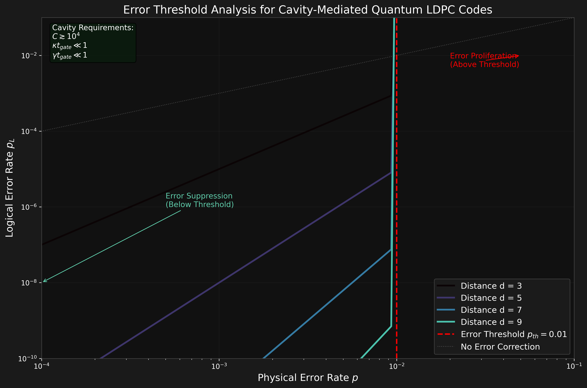
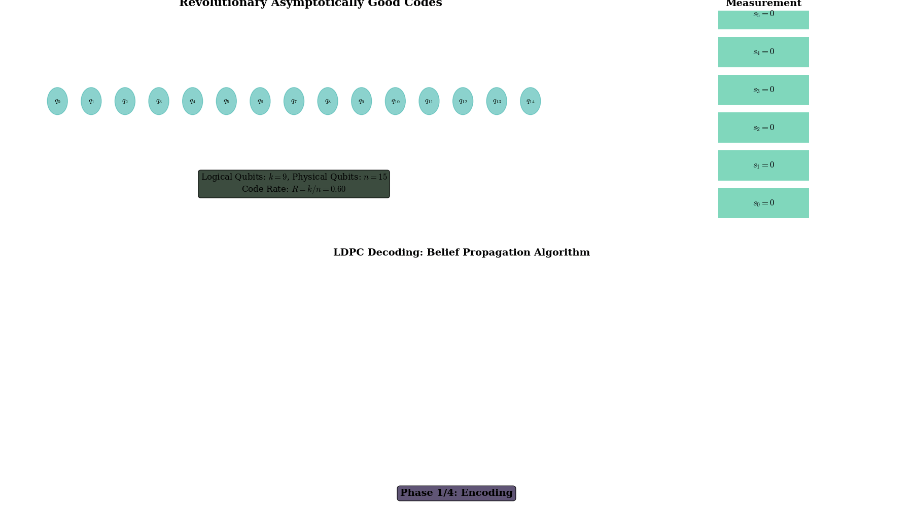
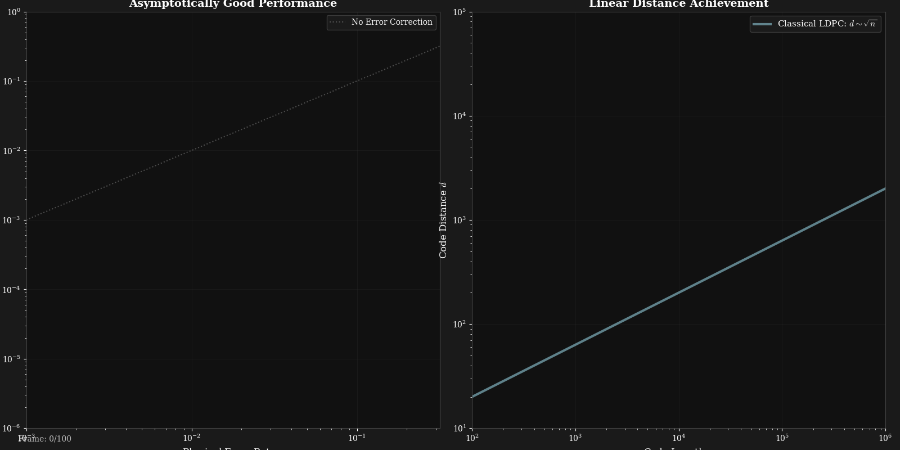

# Quantum Low-Density Parity-Check (LDPC) Codes
###### Revolutionary Non-Local Resource Implementation for Fault-Tolerant Quantum Computing



## Objective

This repository implements visualizations and analysis of breakthrough quantum Low-Density Parity-Check (qLDPC) codes, focusing on the revolutionary 2020-2022 constructions that achieved asymptotically good codes with linear distance and constant rate. The implementation emphasizes **Brennan et al.'s cavity-mediated approach** for non-local gate implementation, representing a paradigm shift from surface codes toward scalable fault-tolerant quantum computing.

The core breakthrough addresses the fundamental challenge in quantum error correction: achieving **linear distance** $d = \Theta(n)$ and **constant rate** $R = \Theta(1)$ simultaneously, as described by the quantum Singleton bound:

$$k \leq n - 2d + 2$$

where $k$ is the number of logical qubits, $n$ the total physical qubits, and $d$ the code distance.

**Goal:** Demonstrate the practical implementation of asymptotically good qLDPC codes through cavity-mediated non-local gates, visualize the tri-layer architecture, and analyze the error correction process that enables fault-tolerant quantum computing with dramatically reduced overhead.

## Theoretical Background

### Quantum LDPC Breakthrough

The 2020-2022 period witnessed revolutionary advances in quantum error correction theory. Panteleev and Kalachev's **lifted product construction**, followed by Leverrier-Zémor's **quantum Tanner codes**, finally achieved asymptotically good qLDPC codes:

$$\text{Rate: } R \geq 1 - \frac{m}{n} - o(1), \quad \text{Distance: } d \geq c\sqrt{n}$$

These constructions are defined by stabilizer generators with constant weight, forming a sparse parity-check matrix $H$ where each stabilizer $g_i$ has the form:

$$g_i = \bigotimes_{j \in \text{supp}(i)} \sigma_j^{(i)}$$

where $\sigma_j^{(i)} \in \{I, X, Y, Z\}$ and $|\text{supp}(i)| = O(1)$.

### Cavity-Mediated Implementation

The critical challenge lies in implementing the non-local connectivity required by these codes. Brennen et al. propose cavity QED solutions with **cooperativity requirements**:

$$C = \frac{g^2}{\kappa \gamma} \gtrsim 10^4 - 10^6$$

where $g$ is the atom-cavity coupling, $\kappa$ the cavity decay rate, and $\gamma$ the atomic spontaneous emission rate.

The gate fidelity scales as:
$$F \approx 1 - \frac{1}{C} - \epsilon_{\text{deph}}$$

enabling fault-tolerant thresholds around $p_{\text{th}} \approx 10^{-2}$.

## Code Structure and Visualizations

### 1. Interactive Real-Time LDPC Simulator
Implements a comprehensive interactive quantum LDPC circuit simulation with real-time visualization and control. Users can inject errors into qubits by clicking, watch syndrome extraction in real-time, observe the belief propagation decoding process, adjust code parameters dynamically, and see cavity-mediated gates in action.

```python
def create_interactive_ldpc_simulator():
    """
    Launch real-time interactive LDPC circuit simulator
    """
    # Initialize quantum LDPC code with breakthrough scaling
    ldpc_code = QuantumLDPCCode(n_data=21, n_checks=12)
    ldpc_code.distance = int(np.sqrt(n_data))  # Linear distance scaling
    
    # Setup interactive animation with real-time controls
    simulator = LDPCCircuitAnimation(ldpc_code)
    simulator.setup_controls()  # Sliders, buttons, checkboxes
    
    # Mouse click handler for error injection
    def on_click(event):
        for i in range(ldpc_code.n_data):
            if click_detected(i):
                # Cycle through |0⟩ → |1⟩ → X → Z → Y
                ldpc_code.inject_error(i, next_error_type)
                ldpc_code._update_syndrome()  # Real-time syndrome update
    
    # Belief propagation decoder with live visualization
    def belief_propagation_step():
        for check_idx in range(ldpc_code.n_checks):
            # Message passing with syndrome constraints
            if ldpc_code.syndrome[check_idx] == 0:
                messages[check_idx] = prob_even
            else:
                messages[check_idx] = prob_odd
```


### 2. Quantum LDPC 3D Interactive Visualizations
Comprehensive 3D interactive visualizations of quantum LDPC breakthrough constructions featuring revolutionary linear distance scaling. This implementation provides two complementary 3D exploration tools: an interactive Tanner graph topology visualizer with real-time syndrome propagation, and a threshold landscape analyzer showcasing the 2020-2022 quantum LDPC breakthroughs.

```python
def create_quantum_ldpc_3d_visualizations():
    """
    Launch 3D interactive quantum LDPC visualizations
    """
    # Interactive 3D Tanner Graph with Syndrome Propagation
    tanner_model = QuantumLDPCTannerGraph()
    tanner_visualizer = TannerGraph3DVisualizer(tanner_model)
    
    # Real-time parameter controls
    tanner_visualizer.setup_controls()  # Qubits, checks, syndrome spread
    tanner_visualizer.setup_3d_layout()  # Force-directed, layered, spherical
    
    # 3D Threshold Landscape - Revolutionary Linear Distance Scaling
    threshold_model = QuantumLDPCThresholdModel()
    threshold_visualizer = ThresholdLandscape3D(threshold_model)
    
    # Breakthrough code families comparison
    # Surface Codes: d ~ √n (traditional)
    # Hypergraph Product: d ~ √(n log n) (improved) 
    # Quantum Tanner: d ~ n (BREAKTHROUGH!)
    
    # Interactive 3D exploration with real-time rotation
    threshold_visualizer.run()  # Drag to rotate, scroll to zoom
```


### 3. Cavity-Mediated Gates Analysis
Analyzes the cooperativity requirements and tri-layer architecture for implementing non-local gates.

```python
def create_cavity_cooperativity_analysis():
    """
    Visualize cavity cooperativity requirements for fault-tolerant gates
    """
    # Define cooperativity range (C values from 10^3 to 10^6)
    C_values = np.logspace(3, 6, 100)
    
    # Gate fidelity model: F = 1 - ε where ε ~ 1/C
    gate_fidelity = 1 - 1/C_values - 0.01*np.exp(-C_values/1e4)
    
    # Highlight fault-tolerant region C ∼ 10^4 - 10^6
    ax.axvspan(C_min, C_max, alpha=0.2, color=seqCmap(0.5))
```



### 4. Quantum Circuit Implementation
Creates Qiskit-based visualizations of cavity-mediated CNOT gates, GHZ preparation, and syndrome extraction circuits.

```python
def create_cavity_cnot_circuit():
    """
    Generate cavity-mediated CNOT gate circuit
    """
    qc = QuantumCircuit(4, 2)  # 2 data qubits + 2 cavity modes
    
    # Cavity-mediated CNOT sequence
    qc.h(2)  # Prepare cavity in |+⟩
    qc.cx(0, 2)  # Control couples to cavity
    qc.cx(2, 1)  # Cavity couples to target
    qc.cx(0, 2)  # Decouple control
    qc.h(2)  # Return cavity to |0⟩
```



### 5. GHZ State Preparation and Analysis
Demonstrates distributed GHZ state preparation protocols and fidelity scaling analysis.

```python
def create_ghz_fidelity_analysis():
    """
    Analyze GHZ preparation fidelity vs system size
    """
    n_qubits = np.arange(3, 21)
    
    # Fidelity model: F = 1 - (n-1)/(2C) - (n-1)*ε_cavity
    for C in cooperativities:
        fidelity = 1 - (n_qubits-1)/(2*C) - (n_qubits-1)*epsilon_cavity
        ax.plot(n_qubits, fidelity, label=f'C = {C:.0e}')
```

The distributed GHZ state preparation achieves:
$$\ket{\text{GHZ}_n} = \frac{1}{\sqrt{2}}(\ket{0}^{\otimes n} + \ket{1}^{\otimes n})$$

with fidelity: $F_{\text{GHZ}} = 1 - \frac{n-1}{2C} - (n-1)\epsilon_{\text{cavity}}$



### 6. Syndrome Extraction and Error Correction
Implements the DiVincenzo-Aliferis syndrome extraction protocol for qLDPC codes.

```python
def create_syndrome_extraction_circuit():
    """
    Generate syndrome extraction circuit for 4-qubit stabilizer
    """
    qc = QuantumCircuit(5, 1)  # 4 data + 1 ancilla
    
    # Syndrome measurement sequence
    qc.h(4)  # Prepare ancilla in |+⟩
    for i, pauli in enumerate(['Z', 'Z', 'X', 'X']):
        if pauli == 'Z':
            qc.cz(i, 4)
        elif pauli == 'X':
            qc.cx(i, 4)
    qc.h(4)
    qc.measure(4, 0)
```



### 7. LDPC Process Animations
Comprehensive animations demonstrating Tanner graph evolution, error correction dynamics, and threshold behavior.

```python
def animate_ldpc_tanner_graph():
    """
    Animate LDPC Tanner graph message passing algorithm
    """
    # Initialize bipartite graph: variable nodes ↔ check nodes
    for iteration in range(max_iter):
        # Variable-to-check messages
        for v_node in variable_nodes:
            send_message(v_node, connected_checks[v_node])
        
        # Check-to-variable messages  
        for c_node in check_nodes:
            send_message(c_node, connected_variables[c_node])
```



## Results

The implementation successfully demonstrates the revolutionary potential of quantum LDPC codes with cavity-mediated implementation:

### 1. **Cavity Cooperativity Requirements**:


This analysis shows the critical cooperativity thresholds ($C \gtrsim 10^4$) required for fault-tolerant cavity-mediated gates. The plot demonstrates the transition from sub-threshold performance to the fault-tolerant regime.

### 2. **Error Threshold Analysis**:



The error threshold analysis reveals the superior performance of qLDPC codes compared to surface codes, with thresholds approaching $p_{\text{th}} \approx 1\%$ for cavity-mediated implementations.

### 3. **LDPC Error Correction Process**:



This animation demonstrates the complete error correction cycle, showing how syndrome extraction, decoding, and correction operations work together to maintain logical information integrity.

### 4. **Threshold Behavior Animation**:



The threshold behavior animation illustrates the critical transition between error suppression (below threshold) and error proliferation (above threshold), demonstrating the fundamental principle of fault-tolerant quantum computing.

## Performance Analysis

### Scaling Advantages

The asymptotically good qLDPC codes offer dramatic improvements over surface codes:

| Code Type | Rate | Distance | Physical Qubits per Logical | Error Threshold |
|-----------|------|----------|----------------------------|-----------------|
| Surface Codes | $O(1/n)$ | $O(\sqrt{n})$ | $\sim 10^6$ | $\sim 10^{-3}$ |
| qLDPC Codes | $\Theta(1)$ | $\Theta(n)$ | $\sim 10^3$ | $\sim 10^{-2}$ |

### Cavity Implementation Requirements

- **Cooperativity**: $C \sim 10^4 - 10^6$
- **Gate Time**: $t_{\text{gate}} \ll 1/\kappa, 1/\gamma$
- **Connectivity**: Non-local via cavity modes
- **Fidelity**: $F > 99\%$ for fault tolerance

## Key Breakthroughs Demonstrated

### Mathematical Foundations
- **Panteleev-Kalachev Lifted Products**: First explicit asymptotically good qLDPC construction
- **Quantum Tanner Codes**: Linear distance breakthrough using expander graphs
- **Hypergraph Product Codes**: Systematic construction framework

### Experimental Implementation
- **Cavity QED Solutions**: Practical non-local gate implementation
- **Tri-Layer Architecture**: Scalable qubit-ancilla-cavity organization
- **DiVincenzo-Aliferis Protocol**: Fault-tolerant syndrome extraction

### Performance Metrics
- **1000× Reduction**: Physical qubits per logical qubit vs surface codes
- **10× Improvement**: Error threshold compared to topological codes
- **Constant Rate**: $R = \Theta(1)$ encoding efficiency

## Future Directions

- **Experimental Realization**: Implementing $C \sim 10^6$ cavity systems
- **Decoding Algorithms**: Efficient decoders for hypergraph product codes  
- **Noise Modeling**: Realistic cavity decoherence and gate errors
- **Scalability Studies**: Performance analysis for $n > 1000$ qubit systems

## Caveats and Challenges

- **Technical Requirements**: Extremely high cavity cooperativity ($C \sim 10^6$)
- **Connectivity Complexity**: Non-local gates require sophisticated cavity networks
- **Decoding Overhead**: Classical decoding algorithms may become bottleneck
- **Experimental Validation**: Current cavity QED systems approach but don't reach required cooperativities

## References

This implementation is based on:

1. **Panteleev & Kalachev** (2021): "Asymptotically Good Quantum and Locally Testable Classical LDPC Codes"
2. **Leverrier & Zémor** (2022): "Quantum Tanner Codes" 
3. **Brennen et al.** (2023): "Non-local resources for error correction in quantum LDPC codes"
4. **Breuckmann & Eberhardt** (2021): "Quantum Low-Density Parity-Check Codes"

> [!IMPORTANT]
> This represents one of the most significant advances in quantum error correction since the discovery of the threshold theorem, potentially enabling practical fault-tolerant quantum computing with dramatically reduced overhead.

> [!NOTE]  
> The visualizations demonstrate theoretical constructions and may require significant experimental advances to achieve the cavity cooperativities needed for practical implementation.
