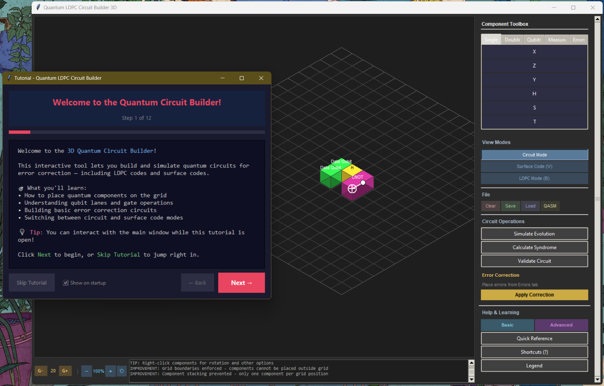
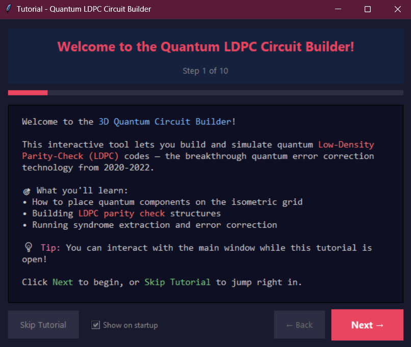
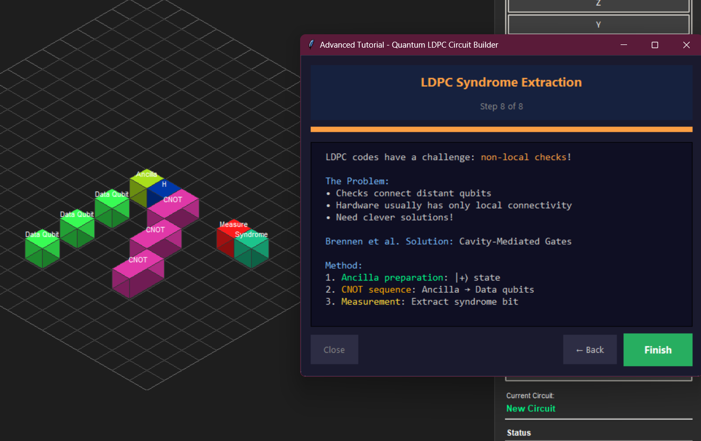

# Quantum Low-Density Parity-Check (LDPC) Codes
###### Non-Local Resource Implementation for Fault-Tolerant Quantum Computing based on [Brennen and Gopi's work](https://arxiv.org/abs/2409.05818)



## Objective

This repository implements visualizations and analysis of breakthrough quantum Low-Density Parity-Check (qLDPC) codes, focusing on the revolutionary 2020-2022 constructions that achieved asymptotically good codes with linear distance and constant rate. The implementation emphasizes non-local gate implementation, representing a paradigm shift from surface codes toward scalable fault-tolerant quantum computing.

The core breakthrough addresses the fundamental challenge in quantum error correction: achieving **linear distance** $d = \Theta(n)$ and **constant rate** $R = \Theta(1)$ simultaneously, as described by the quantum Singleton bound:

$$k \leq n - 2d + 2$$

where $k$ is the number of logical qubits, $n$ the total physical qubits, and $d$ the code distance.

**Goal:** Demonstrate the practical implementation of asymptotically good qLDPC codes through cavity-mediated non-local gates, visualize the tri-layer architecture, and analyze the error correction process that enables fault-tolerant quantum computing with dramatically reduced overhead.

<p align="center">
  
</p>

## Theoretical Background

### Quantum LDPC Breakthrough

The 2020-2022 period witnessed revolutionary advances in quantum error correction theory. Panteleev and Kalachev's **lifted product construction**, followed by Leverrier-Zémor's **quantum Tanner codes**, finally achieved asymptotically good qLDPC codes:

$$\text{Rate: } R \geq 1 - \frac{m}{n} - o(1), \quad \text{Distance: } d \geq c\sqrt{n}$$

These constructions are defined by stabilizer generators with constant weight, forming a sparse parity-check matrix $H$ where each stabilizer $g_i$ has the form:

$$g_i = \bigotimes_{j \in \text{supp}(i)} \sigma_j^{(i)}$$

where $\sigma_j^{(i)} \in \{I, X, Y, Z\}$ and $|\text{supp}(i)| = O(1)$.

### Cavity-Mediated Implementation

The critical challenge lies in implementing the non-local connectivity required by these codes. Brennen et al. propose cavity QED solutions with **cooperativity requirements**:

$$C = \frac{g^2}{\kappa \gamma} \gtrsim 10^4 - 10^6$$

where $g$ is the atom-cavity coupling, $\kappa$ the cavity decay rate, and $\gamma$ the atomic spontaneous emission rate.

The gate fidelity scales as:
$$F \approx 1 - \frac{1}{C} - \epsilon_{\text{deph}}$$

enabling fault-tolerant thresholds around $p_{\text{th}} \approx 10^{-2}$.

## Code Structure and Visualizations

### 1. Live Circuit Builder
This module implements a real-time interactive quantum circuit builder using a custom dark-themed GUI. The application provides a 2.5D isometric perspective, allowing users to drag and drop 3D quantum circuit components (such as Data Qubits, Parity Checks, and CNOT gates) onto a grid-based canvas. The quantum backend integrates with Qiskit for state simulation and circuit export, with optimized numerical routines for syndrome calculation.

```python
# Launch the circuit builder (run from Code/Circuit Builder/)
import subprocess
subprocess.run(['python', 'quantum_circuit_builder_3d.py'])

# Or import and run programmatically
from quantum_circuit_builder_3d import CircuitBuilder3D
builder = CircuitBuilder3D()
builder.run()
```

#### Example Circuits

The circuit builder includes a library of pre-built quantum circuits demonstrating various error correction schemes and quantum algorithms. Users can load circuits including quantum teleportation, GHZ state preparation, Grover's algorithm, Deutsch-Jozsa, and multiple LDPC constructions (hypergraph product, quantum Tanner codes, syndrome extraction). Each circuit can be loaded, modified, and analyzed in real-time through the File menu.


#### Interactive Tutorial

The circuit builder includes a comprehensive 10-step interactive tutorial system accessible via the Help menu. The basic tutorial guides users through fundamental quantum computing concepts: qubit placement, single-qubit gates (X, Y, Z, H, S, T), two-qubit gates (CNOT, CZ), controlled gate creation, and the three-qubit repetition code. Each step includes live demonstrations that place example components on the grid.




The advanced Surface Code Tutorial provides deeper coverage of error correction: surface code lattice structure with X/Z stabilizers, error injection and syndrome measurement, LDPC mode with Tanner graph visualization, and comparison between surface codes and qLDPC constructions.


#### Surface Code Mode

Press `V` to toggle into Surface Code Mode, which renders a 2D top-down lattice view optimized for topological code construction. In this mode, burgundy squares represent X-stabilizers (plaquette operators) and purple squares represent Z-stabilizers (vertex operators). Data qubits are placed on edges between stabilizers. The mode supports error injection (X, Z, Y errors) with visual syndrome highlighting, allowing users to observe how errors propagate through the stabilizer structure.


#### QLDPC Mode

Press `B` to cycle through LDPC visualization modes: Tanner graph view and physical layout view. The Tanner graph mode displays the bipartite graph structure with data qubits (teal), X-check nodes (coral), and Z-check nodes (gold) connected by edges representing the parity-check matrix. The physical layout mode shows the tri-layer architecture with X-ancilla, data qubit, and Z-ancilla rows connected via a cavity bus for non-local gate implementation. Arc connections visualize the sparse LDPC connectivity pattern.


#### Resources

The Help menu provides quick access to essential references: a keyboard shortcuts dialog (`?`) listing all hotkeys for navigation, component manipulation, and mode switching; a Quick Reference guide with component descriptions and circuit building tips; and a visual Component Legend showing the 3D isometric representation of all available gates, qubits, and stabilizer elements with their corresponding colors and symbols.


### 2. Interactive Real-Time LDPC Simulator
This module provides a matplotlib-based interactive simulation environment for exploring quantum LDPC error correction in real-time. The simulator initializes a sparse parity-check matrix $H$ with configurable parameters (default: 21 data qubits, 12 check nodes) maintaining the LDPC property where each check connects to approximately 6 qubits and each qubit participates in approximately 3 checks.

Users can inject errors by clicking directly on qubit nodes, cycling through states: $|0\rangle \rightarrow |1\rangle \rightarrow X\text{-error} \rightarrow Z\text{-error} \rightarrow Y\text{-error}$. The syndrome vector updates immediately, highlighting which parity checks detect the error. The belief propagation decoder runs iteratively, with variable-to-check and check-to-variable messages visualized as the algorithm converges. A cooperativity slider ($C = 10^3$ to $10^6$) adjusts the cavity-mediated gate fidelity model $F = 1 - 1/C - \epsilon_{\text{deph}}$, demonstrating how hardware parameters affect error correction performance.

```python
# Launch the interactive LDPC simulator (run from Code/LDPC Circuit/)
import subprocess
subprocess.run(['python', 'realtime_ldpc_circuit.py'])

# Or run the simulation programmatically
from realtime_ldpc_circuit import QuantumLDPCCode, create_interactive_ldpc_animation
ldpc_code = QuantumLDPCCode(n_data=21, n_checks=12)
ldpc_code.inject_error(qubit_idx=5, error_type=2)  # Inject X-error
print(f"Syndrome: {ldpc_code.syndrome}")
print(f"Gate fidelity at C=1e5: {ldpc_code._calculate_gate_fidelity():.6f}")
```


### 3. GHZ State Preparation and Analysis
Greenberger-Horne-Zeilinger (GHZ) states are maximally entangled $n$-qubit states essential for quantum error correction ancilla preparation and multi-qubit stabilizer measurements. This module analyzes cavity-mediated GHZ preparation where atoms interact through a shared optical cavity mode, enabling the simultaneous entanglement of spatially separated qubits.

The visualization compares preparation fidelity across different cooperativity regimes ($C = 10^3, 10^4, 10^5, 10^6$) as a function of qubit count. The fidelity degradation follows $F = \exp(-n\epsilon)$ where the effective error rate $\epsilon \sim 1/C$ depends on cavity parameters. A secondary analysis plots preparation time versus cooperativity, showing the trade-off between gate speed (scaling as $1/\sqrt{C}$) and the decoherence time limit (~100 μs for typical atomic systems). This informs the practical constraints for multi-qubit stabilizer measurements in qLDPC implementations.

```python
# Generate GHZ fidelity analysis plot (run from Code/LDPC Simulation/)
import numpy as np
import matplotlib.pyplot as plt

n_qubits = np.arange(3, 21)
cooperativities = [1e3, 1e4, 1e5, 1e6]
epsilon_cavity = 0.001

for C in cooperativities:
    fidelity = np.exp(-n_qubits * (1/C + epsilon_cavity))
    plt.plot(n_qubits, fidelity, 'o-', label=f'C = {C:.0e}')

plt.xlabel('Number of Qubits')
plt.ylabel('GHZ State Fidelity')
plt.legend()
plt.savefig('ghz_fidelity_analysis.png', dpi=300)
```

The distributed GHZ state preparation achieves:
$$\ket{\text{GHZ}_n} = \frac{1}{\sqrt{2}}(\ket{0}^{\otimes n} + \ket{1}^{\otimes n})$$

with fidelity: $F_{\text{GHZ}} = 1 - \frac{n-1}{2C} - (n-1)\epsilon_{\text{cavity}}$


### 4. Syndrome Extraction and Error Correction
Syndrome extraction is the critical subroutine in quantum error correction that measures stabilizer operators without collapsing the encoded logical information. This module implements the DiVincenzo-Aliferis fault-tolerant measurement protocol, which uses an ancilla qubit prepared in $|+\rangle$, applies controlled operations based on the stabilizer's Pauli structure, and measures in the X-basis to extract the syndrome bit.

For a weight-4 stabilizer $g = Z_0 Z_1 X_2 X_3$, the circuit applies CZ gates for Z-components and CNOT gates for X-components between data qubits and the ancilla. The visualization includes syndrome error analysis comparing different repetition strategies (direct measurement, single/double repeat, majority voting) and their effect on logical error rates across code distances $d = 3, 5, 7, 9$. This demonstrates how measurement error mitigation techniques improve the effective threshold for fault-tolerant operation.

```python
# Generate syndrome extraction circuit (requires qiskit)
from qiskit import QuantumCircuit, QuantumRegister, ClassicalRegister
from qiskit.visualization import circuit_drawer

qr = QuantumRegister(5, 'q')  # 4 data + 1 ancilla
cr = ClassicalRegister(1, 'syndrome')
qc = QuantumCircuit(qr, cr)

# Syndrome extraction for stabilizer g = Z₀Z₁X₂X₃
qc.h(4)  # Prepare ancilla in |+⟩
qc.cz(0, 4)  # Z-type: CZ gates
qc.cz(1, 4)
qc.cx(2, 4)  # X-type: CNOT gates  
qc.cx(3, 4)
qc.h(4)
qc.measure(4, 0)

print(qc.draw())
qc.draw('mpl').savefig('syndrome_extraction_circuit.png')
```


### 5. LDPC Process Animations
This module generates animated visualizations of the core LDPC algorithms and structures. The Tanner graph animation illustrates the bipartite graph construction where variable nodes (data qubits $q_0, ..., q_{n-1}$) connect to check nodes (syndrome bits $s_0, ..., s_{m-1}$) according to the parity-check matrix $H$. Edges are drawn progressively to demonstrate the sparse connectivity pattern characteristic of LDPC codes.

The belief propagation animation shows the iterative message-passing decoder: variable-to-check messages carry probability estimates based on channel observations, while check-to-variable messages enforce parity constraints from the syndrome. The animation tracks convergence over iterations, visualizing how soft information propagates through the graph until qubit error estimates stabilize. Accompanying parity-check matrix heatmaps display the sparse structure of $H$ with highlighted non-zero entries indicating qubit-check connections.

```python
# Generate LDPC Tanner graph animation (run from Code/LDPC Simulation/)
import subprocess
subprocess.run(['python', 'ldpc_process_animation.py'])

# Or generate individual visualizations
from ldpc_process_animation import create_ldpc_tanner_graph_animation
from ldpc_process_animation import create_parity_check_visualization

create_ldpc_tanner_graph_animation()  # Saves to Plots/ldpc_tanner_graph_animation.gif
create_parity_check_visualization()   # Saves to Plots/parity_check_matrix.png
```


## Performance Analysis

### Scaling Advantages

The asymptotically good qLDPC codes offer dramatic improvements over surface codes:

| Code Type | Rate | Distance | Physical Qubits per Logical | Error Threshold |
|-----------|------|----------|----------------------------|-----------------|
| Surface Codes | $O(1/n)$ | $O(\sqrt{n})$ | $\sim 10^6$ | $\sim 10^{-3}$ |
| Hypergraph Product | $O(1)$ | $O(\sqrt{n})$ | $\sim 10^4$ | $\sim 10^{-2}$ |
| Lifted Product | $\Theta(1)$ | $\Theta(\sqrt{n}\log n)$ | $\sim 10^3$ | $\sim 10^{-2}$ |
| Quantum Tanner | $\Theta(1)$ | $\Theta(n)$ | $\sim 10^3$ | $\sim 10^{-2}$ |

### Cavity Implementation Requirements

- **Cooperativity**: $C \sim 10^4 - 10^6$
- **Gate Time**: $t_{\text{gate}} \ll 1/\kappa, 1/\gamma$
- **Connectivity**: Non-local via cavity modes
- **Fidelity**: $F > 99\%$ for fault tolerance

## Key Contributions

This implementation demonstrates cavity-mediated non-local gates for qLDPC codes using the tri-layer qubit-ancilla-cavity architecture. The visualizations cover DiVincenzo-Aliferis syndrome extraction, belief propagation decoding, and comparative analysis of code families (surface, hypergraph product, lifted product, quantum Tanner). The theoretical overhead reduction from $\sim 10^6$ to $\sim 10^3$ physical qubits per logical qubit motivates continued experimental development toward the required cooperativity regime ($C \sim 10^4 - 10^6$).

## Future Directions

- **Decoder Integration**: Implement BP+OSD (Ordered Statistics Decoding) and BP+LSD for improved threshold performance on degenerate quantum codes
- **Code Constructions**: Add support for bivariate bicycle codes and expander-based constructions with explicit distance bounds
- **Noise Modeling**: Incorporate circuit-level noise models with realistic cavity decoherence, crosstalk, and leakage errors
- **Scalability**: Extend simulations to $n > 1000$ qubits with sparse matrix optimizations and GPU acceleration
- **Hardware Mapping**: Develop compilation tools for mapping qLDPC circuits to specific cavity QED architectures

## References

This implementation is based on:

1. **Panteleev & Kalachev** (2021): "Asymptotically Good Quantum and Locally Testable Classical LDPC Codes"
2. **Leverrier & Zémor** (2022): "Quantum Tanner Codes" 
3. **Brennen et al.** (2023): "Non-local resources for error correction in quantum LDPC codes"
4. **Breuckmann & Eberhardt** (2021): "Quantum Low-Density Parity-Check Codes"

> [!IMPORTANT]
> This represents one of the most significant advances in quantum error correction since the discovery of the threshold theorem, potentially enabling practical fault-tolerant quantum computing with dramatically reduced overhead.

> [!NOTE]  
> The visualizations demonstrate theoretical constructions and may require significant experimental advances to achieve the cavity cooperativities needed for practical implementation.


