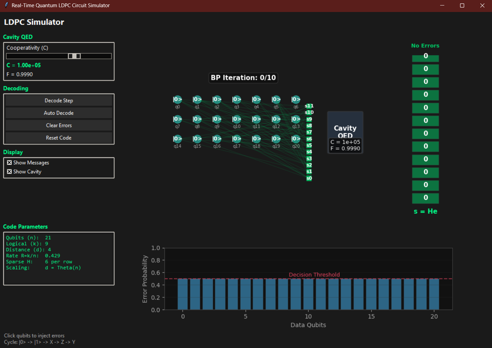
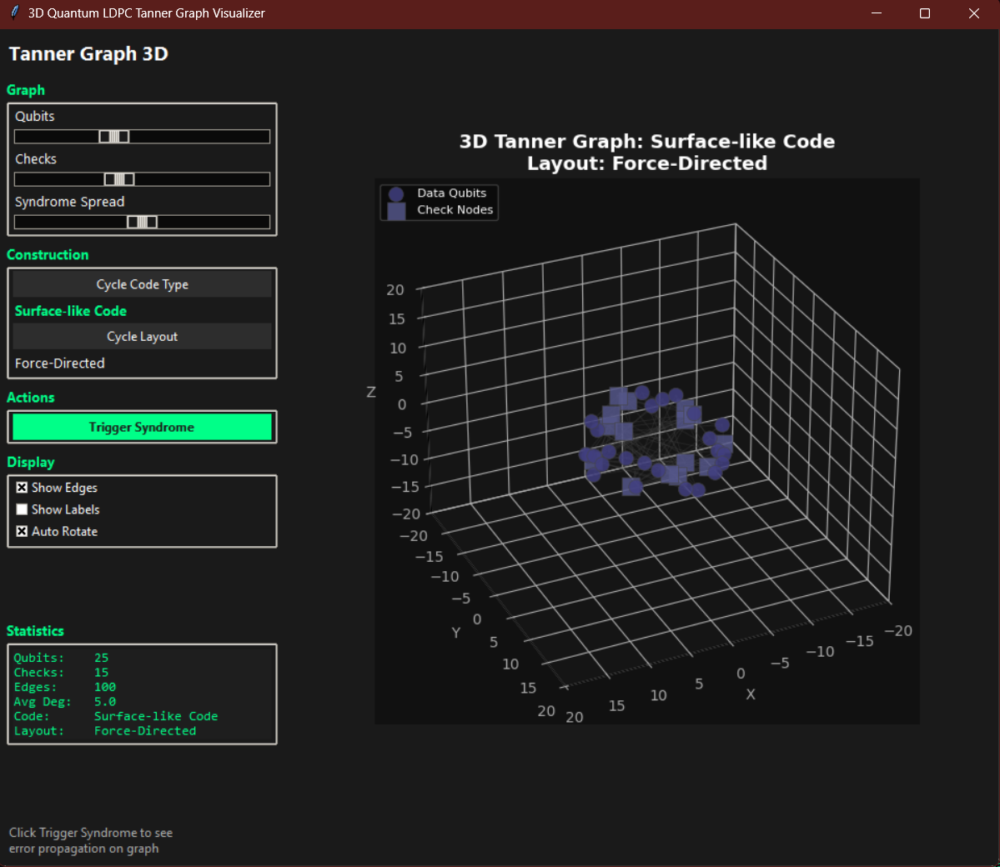
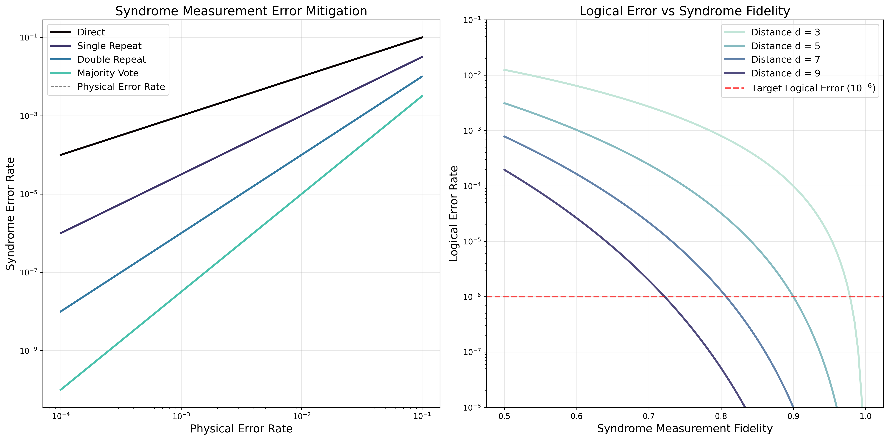

<p align="center">
  
</p>

<h1 align="center">QLDPC</h1>

<p align="center">
  Interactive Python toolkit for quantum LDPC error correction.<br>
  Drag-and-drop 3D circuit builder, real-time belief propagation, surface code & Tanner graph visualization, with Qiskit integration.
</p>

<p align="center">
  <a href="https://github.com/btq-ag/QLDPC/actions/workflows/ci.yml"></a>
  <a href="https://www.python.org/"></a>
  <a href="LICENSE"></a>
  <a href="#quick-start"></a>
</p>

<p align="center">
  <a href="#overview">Overview</a> |
  <a href="#quick-start">Quick Start</a> |
  <a href="#features">Features</a> |
  <a href="#architecture">Architecture</a> |
  <a href="#theory">Theory</a> |
  <a href="#references">References</a> |
  <a href="CONTRIBUTING.md">Contributing</a> |
  <a href="docs/">Docs</a>
</p>

<p align="center">
  
</p>

---

## Overview

Build and simulate quantum LDPC circuits interactively. The circuit builder supports isometric 3D, surface code, and Tanner graph visualization modes with real-time Qiskit-backed computation. Includes belief propagation decoding, cavity QED parameter exploration, threshold landscape analysis, and 30 pre-built example circuits.

### Why QLDPC?

The 2020–2022 breakthroughs in quantum error correction — lifted product codes (Panteleev & Kalachev) and quantum Tanner codes (Leverrier & Zémor) — demonstrated for the first time that quantum LDPC codes can achieve constant rate **and** linear distance simultaneously. These codes dramatically reduce the qubit overhead required for fault-tolerant quantum computing compared to the surface code, but their non-local stabilizer structure makes them harder to visualize and build intuition for.

**QLDPC** bridges that gap. It provides drag-and-drop circuit construction, real-time belief propagation decoding, interactive Tanner graph exploration, and cavity QED parameter sweeps — all in a unified dark-themed toolkit. Whether you are a researcher prototyping new code families or a student learning about quantum error correction for the first time, QLDPC gives you hands-on, visual access to the structures that will underpin the next generation of quantum hardware.

---

## Quick Start

```bash
# Clone and install
git clone https://github.com/btq-ag/QLDPC.git
cd QLDPC
pip install -e .

# Optional: install Qiskit for full quantum simulation
pip install -e ".[quantum]"
```

Launch any tool from the command line:

```bash
qldpc-builder       # Interactive 3D circuit builder
qldpc-simulator     # Real-time LDPC simulator
qldpc-tanner        # 3D Tanner graph visualizer
qldpc-threshold     # 3D threshold landscape
```

Or import directly:

```python
from qldpc.builder import CircuitBuilder3D

app = CircuitBuilder3D()
app.run()
```

---

## Features

### Circuit Builder

Full-featured drag-and-drop circuit editor with live isometric 3D rendering. Supports 10+ gate types (X, Y, Z, H, S, T, CNOT, CZ, SWAP, Measure, Reset) and ships with 30 pre-built example circuits — from basic teleportation and Grover's algorithm to LDPC syndrome extraction and Deutsch-Jozsa. The dark-themed tkinter GUI includes undo/redo history, Qiskit circuit export, and an integrated tutorial system that walks new users through qubit placement, gate operations, and code construction step by step.


### Surface Code Mode

Press `V` to toggle a top-down 2D lattice view of the surface code. X-stabilizers (burgundy) and Z-stabilizers (purple) tile the lattice with data qubits on edges. Click any data qubit to inject X, Z, or Y errors and watch syndrome propagation ripple through the stabilizer network in real time — a direct visual demonstration of how local errors are flagged by adjacent check operators.


### LDPC Visualization Modes

Press `B` to cycle through LDPC-specific rendering modes. The **Tanner graph** view draws the bipartite structure with data qubits, X-check nodes, and Z-check nodes, exposing the sparsity pattern that makes LDPC decoding efficient. The **physical layout** view shows a tri-layer architecture with cavity bus connections, mapping abstract code structure onto a potential hardware realization where non-local stabilizers are mediated by optical cavities.


### Interactive Tutorial System

A 10-step guided tutorial accessible from the Help menu. Covers qubit placement, single- and multi-qubit gates, controlled operations, repetition code construction, and surface code basics. Each step highlights the relevant UI elements and provides context boxes explaining the underlying quantum error correction concepts.


### Real-Time LDPC Simulator

Dark-themed tkinter GUI with embedded matplotlib panels for interactive LDPC experimentation. Click anywhere on the code block to inject bit-flip or phase-flip errors, then step through (or auto-run) belief propagation decoding and watch messages converge in real time. A cooperativity slider sweeps the cavity QED parameter $C$ and updates the gate fidelity model $F \approx 1 - 1/C - \epsilon_{\text{deph}}$, letting you explore how hardware parameters affect logical error rates.



### 3D Tanner Graph Visualizer

Interactive 3D exploration of LDPC Tanner graph topologies with force-directed and spectral layout engines. Rotate, zoom, and click individual nodes to highlight their check neighborhoods. Compare hypergraph product, lifted product, and quantum Tanner code constructions side by side, and propagate syndromes through the graph to build intuition for decoder behavior on different code families.

```bash
qldpc-tanner
```



### Static Visualizations

Publication-quality dark-themed plots generated by the simulation modules. Covers cavity cooperativity analysis, GHZ state fidelity and scaling, syndrome extraction circuits, fault-tolerant measurement protocols, and animated LDPC process walkthroughs. Regenerate all figures at once with:

```bash
python generate_all_plots.py            # PNGs + GIF animations
python generate_all_plots.py --skip-animations   # PNGs only (faster)
```

<table>
  <tr>
    <td></td>
    <td></td>
    <td></td>
  </tr>
  <tr>
    <td></td>
    <td></td>
    <td></td>
  </tr>
</table>


### Resources & Shortcuts

Quick access to keyboard shortcuts, component legend, and reference materials via the Help menu.


---

## Architecture

```
qldpc/
    __init__.py              # Package root (ComponentType, Config, Processor)
    components.py            # ViewMode, ComponentType, Component3D
    config.py                # GridConfig, UIConfig, ColorPalette, LDPC colors
    processor.py             # QuantumLDPCProcessor (Qiskit backend)
    builder/
        app.py               # CircuitBuilder3D main application (tkinter)
        tutorials.py         # Interactive tutorial screens
        renderers/
            isometric.py     # 2.5D isometric rendering engine
        ui/
            history.py       # Undo/redo command pattern
    simulation/
        ldpc_circuit.py      # QuantumLDPCCode + LDPCSimulatorGUI
        cavity_gates.py      # Cooperativity analysis, tri-layer architecture
        ghz.py               # GHZ state preparation and fidelity
        syndrome.py          # Syndrome extraction visualization
        animations.py        # Tanner graph, BP, threshold animations
        quantum_circuits.py  # Static circuit diagram generation
    tanner/
        graph_3d.py          # 3D Tanner graph visualizer
        threshold_3d.py      # 3D threshold landscape visualizer
saved_circuits/
    circuits/                # 22 pre-built quantum circuits
    surface/                 # 8 surface code configurations
tests/                       # pytest suite (64 tests)
docs/                        # Technical documentation
Plots/                       # Generated figures and screenshots
```

| Module | Entry Point | Description |
|--------|-------------|-------------|
| `qldpc.builder.app` | `qldpc-builder` | Interactive 3D circuit builder with 4 view modes |
| `qldpc.simulation.ldpc_circuit` | `qldpc-simulator` | Real-time LDPC error injection and BP decoding |
| `qldpc.tanner.graph_3d` | `qldpc-tanner` | 3D Tanner graph topology explorer |
| `qldpc.tanner.threshold_3d` | `qldpc-threshold` | 3D error threshold landscape |

### Tech Stack

| Technology | Role |
|------------|------|
| Python 3.9+ | Core language |
| tkinter | Dark-themed GUI framework (all interactive tools) |
| matplotlib | Embedded plotting, static figures, animations |
| NumPy | Numerical computation, parity matrices |
| Seaborn | Color palettes, statistical visualization |
| NetworkX | Graph structures for Tanner graphs |
| Qiskit (optional) | Quantum circuit simulation and export |

---

## Theory

### Motivation

Classical low-density parity-check (LDPC) codes revolutionized telecommunications by approaching the Shannon limit with linear-time encoding and decoding. Their quantum counterparts promise a similar revolution for fault-tolerant quantum computing: families of stabilizer codes whose parity-check matrices are sparse, enabling efficient syndrome extraction and message-passing decoders such as belief propagation. The central challenge — and the reason quantum LDPC codes took decades longer to develop — is that the CSS construction requires **two** parity-check matrices $H_X$ and $H_Z$ that must satisfy the symplectic orthogonality constraint $H_X H_Z^T = 0$, severely limiting the design space compared to the classical case.

### Classical LDPC Codes

A classical binary LDPC code $\mathcal{C}[n, k]$ is defined by an $m \times n$ parity-check matrix $H$ with column weight $w_c$ and row weight $w_r$, both of which are bounded constants independent of $n$. The code corrects errors by computing the syndrome $\mathbf{s} = H \mathbf{e}$ and running a message-passing decoder on the Tanner graph — a bipartite graph whose left vertices represent the $n$ variable nodes (bits) and whose right vertices represent the $m$ check nodes (parity constraints). Because $H$ is sparse, syndrome computation runs in $O(n)$ time and belief propagation decoding converges in $O(\log n)$ iterations for codes above the belief propagation threshold.

### CSS Construction

The Calderbank-Shor-Steane (CSS) construction converts a pair of classical codes into a quantum stabilizer code. Given two classical codes $\mathcal{C}_X [n, k_X]$ and $\mathcal{C}_Z [n, k_Z]$ with parity-check matrices $H_X$ and $H_Z$ satisfying:

$$H_X H_Z^T = 0 \pmod{2}$$

the resulting quantum code $\mathcal{Q}[[n, k, d]]$ encodes $k = n - \operatorname{rank}(H_X) - \operatorname{rank}(H_Z)$ logical qubits with distance $d = \min(d_X, d_Z)$. The X-stabilizers are the rows of $H_X$ (each row specifies a tensor product of Pauli-$X$ operators) and the Z-stabilizers are the rows of $H_Z$. The orthogonality condition ensures that X- and Z-stabilizers commute, as required by the Pauli group algebra. The surface code is the simplest CSS–LDPC code: it achieves $d = O(\sqrt{n})$ but has vanishing rate $R = k/n \to 0$.

### Hypergraph Product Codes

Tillich and Zémor's hypergraph product (2014) takes two classical LDPC codes $\mathcal{C}_1 [n_1, k_1, d_1]$ and $\mathcal{C}_2 [n_2, k_2, d_2]$ and produces a CSS code with:

$$H_X = \begin{pmatrix} H_1 \otimes I_{n_2} & I_{m_1} \otimes H_2^T \end{pmatrix}, \quad H_Z = \begin{pmatrix} I_{n_1} \otimes H_2 & H_1^T \otimes I_{m_2} \end{pmatrix}$$

The resulting code has parameters $n = n_1 n_2 + m_1 m_2$, $k = k_1 k_2$, and $d \geq \min(d_1, d_2)$. Crucially, $H_X H_Z^T = H_1 H_1^T \otimes I + I \otimes H_2 H_2^T = 0$ is automatically satisfied. Hypergraph product codes achieve constant rate $R = \Theta(1)$ but their distance grows only as $d = O(\sqrt{n})$, matching the surface code scaling.

### Lifted Product and Quantum Tanner Codes

The 2020–2022 breakthroughs shattered the $\sqrt{n}$ distance barrier:

- **Lifted product codes** (Panteleev & Kalachev, 2021): Replace scalar entries in the parity-check matrix with elements of a group algebra $\mathbb{F}_2[G]$ over a finite group $G$. The resulting codes achieve $d = \Theta(\sqrt{n} \log n)$ with constant rate. The key insight is that the group structure induces additional algebraic constraints that boost minimum distance without sacrificing sparsity.

- **Quantum Tanner codes** (Leverrier & Zémor, 2022): Built on Cayley graphs of groups with good expansion properties, these codes achieve the holy grail: constant rate $R = \Theta(1)$ **and** linear distance $d = \Theta(n)$ simultaneously. The construction uses local codes on the faces of a square complex derived from the Cayley graph, and the expansion property of the underlying graph ensures that errors cannot form small undetectable configurations. This approaches the quantum Singleton bound:

$$k \leq n - 2d + 2$$

### Cavity QED Implementation

Non-local stabilizer measurements required by quantum LDPC codes can be physically realized through cavity-mediated gates. Atoms (qubits) couple to a shared optical cavity mode with strength $g$, enabling effective qubit-qubit interactions across macroscopic distances. The cavity cooperativity:

$$C = \frac{g^2}{\kappa \gamma}$$

where $\kappa$ is the cavity decay rate and $\gamma$ is the atomic spontaneous emission rate, determines the achievable gate fidelity:

$$F \approx 1 - \frac{1}{C} - \epsilon_{\text{deph}}$$

Fault-tolerant operation requires $C \gtrsim 10^4\text{–}10^6$. This tri-layer architecture (data qubits → ancilla qubits → cavity modes) maps naturally onto the Tanner graph structure of the code, with each cavity bus mediating the non-local parity checks that distinguish quantum LDPC codes from geometrically local alternatives like the surface code.

### Belief Propagation Decoding

Belief propagation (BP) is the standard decoder for LDPC codes. Operating on the Tanner graph, BP iteratively passes messages between variable nodes and check nodes:

1. **Variable → Check**: Each variable node $v$ sends to each neighboring check node $c$ a log-likelihood ratio (LLR) summarizing the evidence from the channel output and all *other* check nodes.
2. **Check → Variable**: Each check node $c$ computes a parity constraint and sends back an updated LLR to each neighboring variable.
3. **Hard decision**: After $T$ iterations (typically $T = 10\text{–}50$), each variable node makes a hard decision based on the accumulated evidence.

For classical LDPC codes, BP achieves near-optimal decoding. For quantum codes, additional challenges arise from the degeneracy of the code (multiple error patterns producing the same syndrome) and the need to decode X and Z errors simultaneously. Modifications such as ordered statistics decoding (OSD) post-processing or neural BP variants can significantly improve quantum LDPC decoding performance.

### Scaling Comparison

| Code Family | Rate | Distance | Qubits / Logical | Threshold |
|------------|------|----------|-------------------|-----------|
| Surface | O(1/n) | O(√n) | ~10⁶ | ~10⁻³ |
| Hypergraph Product | O(1) | O(√n) | ~10⁴ | ~10⁻² |
| Lifted Product | Θ(1) | Θ(√n log n) | ~10³ | ~10⁻² |
| Quantum Tanner | Θ(1) | Θ(n) | ~10³ | ~10⁻² |

---

## References

1. Panteleev & Kalachev (2021) – "Asymptotically Good Quantum and Locally Testable Classical LDPC Codes" ([arXiv:2111.03654](https://arxiv.org/abs/2111.03654))
2. Leverrier & Zémor (2022) – "Quantum Tanner Codes" ([arXiv:2202.13641](https://arxiv.org/abs/2202.13641))
3. Brennen et al. (2023) – "Non-local resources for error correction in quantum LDPC codes" ([arXiv:2409.05818](https://arxiv.org/abs/2409.05818))
4. Breuckmann & Eberhardt (2021) – "Quantum Low-Density Parity-Check Codes" ([arXiv:2103.06309](https://arxiv.org/abs/2103.06309))
5. Tillich & Zémor (2014) – "Quantum LDPC Codes With Positive Rate and Minimum Distance Proportional to the Square Root of the Blocklength" ([arXiv:0903.0566](https://arxiv.org/abs/0903.0566))

### BibTeX

```bibtex
@software{morais2025qldpc,
    title  = {QLDPC: Interactive Quantum LDPC Error Correction Toolkit},
    author = {Morais, Jeffrey},
    year   = {2025},
    url    = {https://github.com/btq-ag/QLDPC}
}
```

---

## See Also

| Project | Description |
|---------|-------------|
| [TQNN](https://github.com/IsolatedSingularity/Topological-Quantum-Neural-Networks) | Topological Quantum Neural Networks — interactive visualization toolkit |
| [Quantum-Chemistry-Eigensolver](https://github.com/IsolatedSingularity/Quantum-Chemistry-Eigensolver) | VQE-based molecular ground-state solver |
| [Bloc-Fantôme](https://github.com/IsolatedSingularity/Bloc-Fantome) | Phantom block decoding experiments |
| [Leonne](https://github.com/btq-ag/Leonne) | BTQ hardware characterization and benchmarking |
| [QRiNG](https://github.com/btq-ag/QRiNG) | Quantum random number generation framework |

---

## Contact

**Jeffrey Morais** — [Website](https://jeffreymorais.netlify.app) | [GitHub](https://github.com/IsolatedSingularity) | [LinkedIn](https://www.linkedin.com/in/jeffrey-morais) | [btq-ag/QLDPC](https://github.com/btq-ag/QLDPC)

Questions, ideas, or contributions are welcome! Open an [issue](https://github.com/btq-ag/QLDPC/issues) or see [CONTRIBUTING.md](CONTRIBUTING.md).

---

## License

[MIT](LICENSE)
